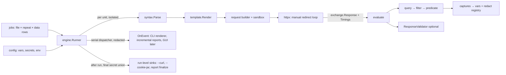

# Sonde Architecture & Cross-Cutting Contracts

> **Owner: this file.** The copy in the private implementation plan is historical.
> **Rule:** any pull request that adds or changes an exported symbol, CLI flag,
> exit code, config key or report field updates this file (and the owning doc)
> in the same pull request. Phase numbers refer to the implementation roadmap.

All paths are relative to the repository root.

## 1. Principles

1. **One engine, many frontends.** CLI now; later Wails v3 GUI (separate plan), `go test` embedding, LSP, MCP. All call the same `engine` package.
2. **Plain text is the source of truth.** `.hurl` = strict Hurl 8 grammar. `.sonde` = a superset: Sonde's protocol extensions (SSE, WebSocket and gRPC since v1.2, [decisions/0004](decisions/0004-streaming-protocols.md), [decisions/0005](decisions/0005-grpc.md)) are allowed **only** in `.sonde`, under a Sonde-specific prefix Hurl will not use, and are parse errors in `.hurl` — *confirmed in validation 2026-09-23*.
3. **Sonde extras never change `.hurl` files.** OpenAPI contracts, data-driven runs, environments = CLI flags / `sonde.yaml` only.
4. **Engine is a library.** No `os.Exit`, no printing, no package globals, no `init()` side effects. `context.Context` cancel everywhere. Typed events delivered serially. JSON-serializable, already-redacted results.
5. **Hurl HTTP semantics, explicit.** Body queries see decoded bytes (`rawbytes` = raw); redirects followed only on request, via a manual loop with curl's credential rules; curl-like defaults (`Accept: */*`, `User-Agent: sonde/<version>`).
6. **Pure Go, static binary.** `CGO_ENABLED=0`, `-trimpath`. No cgo dependencies in the CLI module.
7. **Secure by default.** TLS verification on; every file path coming from a request file goes through one sandboxed file-access layer; `--file-root` is CLI-only and `sonde.yaml` cannot change file access; secrets redacted inside the engine before anything leaves it; zero telemetry; no network access except requests the user wrote.
8. **Hurl-compatible CLI surface.** `sonde [options] FILE...` behaves like `hurl`, `sonde --test` like `hurl --test`; Hurl flag names, `HURL_*` env options, Hurl config file, exit codes — verified by running Hurl's own test scripts through a `hurl` → `sonde` shim.

## 2. Module & Package Map

Module: `github.com/nhtera/sonde` · `go 1.26` directive (supports Go 1.26 + 1.27) · toolchain `go1.27.x`.

| Package | Role | Allowed internal deps |
|---|---|---|
| `cmd/sonde` | `main` → `cli.Execute()` | `internal/cli` |
| `engine` (**public**) | `Runner` (`RunFile`, `RunSource`, `RunAll`, `RenderCurl`), `Options`, `HTTPOptions`, events, results (`Error`, `Value`), `ResponseValidator`, `Violation` | syntax, value, redact, template, query, filter, predicate, runerr, exchange, httpx, stream, grpcx, sandbox, enginex |
| `internal/enginex` | constructors of engine result values for internal tests, and engine settings and host hooks kept out of the public API (host allowlist, desktop events, WebSocket sessions, gRPC descriptors), set by `engine` | exchange, runerr, syntax, value, netpolicy, grpcx, stream |
| `exchange` (**public**) | transport-neutral `Request`/`Response`/`Timings`/`CertInfo`/`Cookie`/`Stream`/`GRPCStatus` model; decoded body (br/gzip/deflate/zstd), charset-decoded text, `Set-Cookie` parsing | charset, codec |
| `internal/syntax` | reader, parser, AST, lossless printer, canonical formatter, diagnostics, dialect gate | regex, styled |
| `internal/regex` | regex validity rules shared by parser and evaluation | — (leaf) |
| `internal/styled` | styled text runs printed plain or with ANSI colors (error snippets) | — (leaf) |
| `internal/value` | typed `Value` (null/bool/int/bigint/float/string/bytes/list/object/date/nodeset/unit/regex/http response); equality, ordering, display/repr/render; JSON decoding; Unicode-aware regex classes | regex |
| `internal/runerr` | runtime error (span, kind, assert flag, messages, plain and colored rendering) shared by evaluation packages | syntax, styled |
| `internal/charset` | WHATWG encoding labels, strict decoding | — (leaf) |
| `internal/datefmt` | strftime-style date formatting and parsing (`dateFormat`, `toDate`, cookie dates) | — (leaf) |
| `internal/xpath` | XPath 1.0 on HTML (lenient) and XML (namespaces) documents | value |
| `internal/codec` | readers undoing HTTP content codings (br, gzip, deflate, zstd), for whole bodies and streams | — (leaf) |
| `internal/redact` | per-run, append-only, concurrency-safe secret registry + encoded-variant matching | — (leaf) |
| `internal/sandbox` | `os.Root`-based file access for all request-file paths; atomic, permission-aware writes and file operations | — (leaf) |
| `internal/template` | `Env` (variables, clock, UUID source, file access), `{{ }}` rendering, functions (`newUuid`, `newDate` — Hurl 8 set only), multiline and JSON body rendering | syntax, value, runerr |
| `internal/jsonpath` | RFC 9535 evaluator over `value.Value`, sorted-key traversal, Hurl unwrap rule (Go port of Hurl's JSONPath module, Apache-2.0, see NOTICE) | value |
| `internal/query` | all Hurl queries over the responses of an entry (redirect chain), with a per-entry parsed-body cache | syntax, value, exchange, template, filter, runerr, xpath, datefmt |
| `internal/filter` | all Hurl filters | syntax, value, jsonpath, template, runerr, xpath, datefmt, charset |
| `internal/predicate` | all Hurl predicates | syntax, value, template, runerr, datefmt |
| `internal/httpx` | client/transport builder, options, manual redirect loop, timings, cookie jar, decompression, streamed-body hook, WebSocket handshake, HTTP/2-only transport for gRPC (h2c, trailers) | exchange, sandbox, codec |
| `internal/report` | JSON result (shared by `--json` and `--report-json`), JUnit, TAP, HTML reports; redacted with the final secret union | engine, exchange |
| `internal/config` | `sonde.yaml`, Hurl config file, variables/secrets files, env vars, precedence, `sonde.yaml`/variables emitter | value, sandbox |
| `internal/dataset` | CSV / JSON-array rows for `--data` | value |
| `internal/runplan` | a run's invocation (flags, `HURL_*`/`SONDE_*`, config file) turned into engine options and jobs, shared by the CLI and the desktop app; capture layering for reruns | engine, config, datarow, openapi, syntax |
| `internal/runflags` | an invocation rendered back to `sonde` arguments or a shell command (POSIX, PowerShell, cmd), secrets as variable references | runplan |
| `internal/syntaxedit` | request files as an entry model (rows, disabled `# ` rows) and one-splice edits checked by reparsing, in UTF-16 offsets | syntax |
| `internal/datarow` | a checked `--data` file as engine rows (secret columns, overrides, clashes) | engine, config, dataset, value |
| `internal/testsummary` | run outcome classification, `--test` status lines and summary | engine |
| `internal/cookiejar` | merged end-of-run cookies written as a Netscape file (`--cookie-jar`) | engine, sandbox |
| `internal/openapi` | spec load (owns remote fetch), route match, `engine.ResponseValidator` impl, spec → AST generator, mock response selection and request validation | exchange, syntax, engine (interface only) |
| `internal/convert` | shared import writer + flags; importers in subpackages `curl`, `postman`, `opencollection`, `httpfile` (curl export uses the engine's renderer, `engine/curl.go`) | syntax, exchange, config, sandbox (subpackages: + convert) |
| `internal/docs` | single doc-data source (`table.yaml`) for compat.md, LSP hover | — |
| `internal/lsp` | language server (`sonde lsp`, stdio): diagnostics, completion, hover, formatting | syntax, config, docs |
| `internal/cli` | cobra commands, Hurl-compatible root, flag → `engine.Options` mapping, output wiring | everything above |
| `internal/mock` | OpenAPI mock server (`sonde mock`): net/http plumbing around `openapi.Mock` | openapi |
| `internal/stream` | SSE parser and reader, WebSocket message scripts (`coder/websocket`) for streamed entries | exchange, httpx |
| `internal/grpcx` | gRPC on the HTTP/2 client: message framing, status codes, descriptors (`.proto` via `protocompile`, descriptor sets, server reflection), proto3 JSON mapping | exchange |
| `internal/mcp` | MCP server (`sonde mcp`): tools on the official Go SDK, root confinement, guarded runs | engine, syntax, config, enginex, netpolicy, openapi, report, sandbox |
| `internal/netpolicy` | Host allowlist of `sonde mcp --allow-host`: pattern parsing, host normalization, matching; checked by httpx on URLs and dials | — |
| `editors/vscode` | VS Code extension (TypeScript) — separate npm package | — |
| `testdata/conformance/hurl` | vendored Hurl 8 test tree + servers + requirements + manifest | — |

**Rules (enforced by `depguard` in `.golangci.yml`):** leaves import nothing internal; nothing imports `internal/cli`; `internal/report` imports only `engine`/`exchange` (the public API); `net/http` allowed only in `httpx`, `stream`, `mock`, `openapi` (remote fetch, opt-in), `grpcx`; `_test.go` files exempt. Go source file names: `snake_case.go`; shell scripts: `kebab-case.sh`. One decision-record series: `docs/decisions/NNNN-*.md` (RFCs are decision records with status `proposed`).

## 3. Execution Flow



Per entry: render → build → send (retry loop wraps the whole entry) → implicit asserts (version, status, headers) → captures (new secrets registered) → explicit asserts → contract validation → emit buffered events (redacted). A unit stops at its first failing entry unless `--continue-on-error`. Units never cancel each other.

## 4. Public API Sketch (`engine`, `exchange`)

```go
package engine

// Runner runs files with shared options; owns the run's secret registry.
func NewRunner(opt Options) *Runner
func (r *Runner) RunFile(ctx context.Context, path string) (*UnitResult, error)
func (r *Runner) RunSource(ctx context.Context, name string, src []byte) (*UnitResult, error)
// RunAll runs jobs, opt.Parallel at a time; closing opt.Stop ends
// scheduling and running units at their next entry boundary
// (UnitResult.Interrupted, not a success), canceling ctx aborts requests.
func (r *Runner) RunAll(ctx context.Context, jobs iter.Seq[Job], opt RunAllOptions)
// RenderCurl renders each entry as a curl command without sending
// anything; an undefined variable stays {{name}} and is listed per entry.
func (r *Runner) RenderCurl(ctx context.Context, name string, src []byte) ([]CurlEntry, error)
func (r *Runner) Redact(s string) string // with every secret known so far
func (r *Runner) Close() error

type RunAllOptions struct { // hook calls never concurrent
	Parallel int
	Stop     <-chan struct{}
	Started  func(seq int, job Job) (onEvent func(Event), stdout io.Writer)
	Finished func(seq int, job Job, res *UnitResult, err error) bool // false = schedule no more
}
type Job struct {
	Name      string
	Source    []byte            // nil = read Name
	Variables map[string]any    // per job (sonde.yaml), below CLI options
	Secrets   map[string]string // per job
	Row       *Row              // data row (--data), nil = none
	Validator ResponseValidator // replaces Options.Validator (NoContract(): none)
}

type UnitResult struct {
	File       string
	Source     []byte
	ParseError *Error // kind ErrorParse; nothing ran
	Entries    []*EntryResult
	Interrupted, Success bool
	// Duration, Cookies, Timestamp, Row
}
func (u *UnitResult) Errors() []*Error        // of attempts not retried
func (u *UnitResult) Label() string          // File, or "<File>#row-<N>"
func (u *UnitResult) Redact(s string) string // run's + row's secrets, one pass

// Error is opaque: Kind() ErrorKind (string constants Error*), Assert(),
// Span(), Description(), Message(), Actual(), Expected(), Render(),
// RenderColor() (no arguments: it knows its file and entry).
type Error struct{ /* unexported */ }
// Value is opaque: Kind() ValueKind (string constants Value*), String(),
// typed accessors Bool/Int/Float/Text/Bytes/Time/Regex/Redirect/List/
// Fields/Get/Len. Also accepted as a variable.
type Value struct{ /* unexported */ }

type Options struct {
	Variables       map[string]any    // nil, bool, int, int64, float64, string, Value, []any, map[string]any
	Secrets         map[string]string // registered in the run's redact registry
	FileRoot        string            // CLI-only; default: dir of each file
	HTTP            HTTPOptions       // global defaults; per-entry [Options] override
	Validator       ResponseValidator // OpenAPI contract, checked after explicit asserts (skipped by NoAssert); nil = off
	OnEvent         func(Event)       // RunFile/RunSource; RunAll uses RunAllOptions.Started
	DefaultUserAgent string           // replaces sonde/<module version>
	Retry           int               // -1 = unlimited
	RetryInterval   time.Duration
	Delay           time.Duration     // not applied to retries
	FromEntry, ToEntry int            // 1-based, 0 = unset
	NoAssert, ContinueOnError bool
	Verbosity       Verbosity
}

// One validator serves every unit of a run (safe for concurrent use).
type ResponseValidator interface {
	ValidateResponse(ctx context.Context, req *exchange.Request, resp *exchange.Response) []Violation
}
```

Internal packages never leak into this surface. `internal/report` consumes
results through it alone (enforced by depguard), which proves it suffices
for a front end. `internal/enginex` builds result values for internal tests.


Events: `Log` (level, text, colored text), `EntryStarted`, `ContractEvaluated` (entry index, raw violations), `EntryFinished` (carries the raw `*EntryResult`). Log texts are redacted; results hold raw values, and every sink redacts them with `UnitResult.Redact` (`Runner.Redact` suffices without data rows; the final secret union for run-level sinks). Per-unit parse/runtime errors live in `UnitResult` and never cancel other units; results are handed to `RunAllOptions.Finished` and not retained by the runner.

API stability: from v1.0 `engine` + `exchange` follow semver, checked by `make apicheck` (apidiff) in CI; see [stability.md](stability.md).

## 5. Contracts

### Exit codes (Hurl 8 + one documented addition)
| Code | Meaning |
|---|---|
| 0 | success |
| 1 | CLI usage / option error |
| 2 | input file parse error (also unreadable input file) |
| 3 | runtime error (connect, TLS, timeout, sandbox denial, unsupported option) |
| 4 | assert / contract failure |
| 127 | undefined error (e.g. report cannot be written) — Hurl parity |
| 130 | interrupted (Ctrl-C) — Sonde addition, documented |

Multi-unit aggregation: 1 and 127 abort; otherwise the most severe of 2 > 3 > 4 > 0 (as Hurl's `main.rs`). Non-run subcommands: `fmt --check` → 1 if unformatted; `import` → 1 on unreadable input, 0 with warnings; `mock` → 1 unloadable spec, 3 bind failure, 0 on SIGTERM, 130 on Ctrl-C.

Error typing in `internal/cli`: flag errors and cobra's own argument/unknown-command errors → 1; any other untyped error from a command body → 127 (`typed` wrapper); commands that print their own diagnostics end with a silent exit (code only, no extra `error:` line).

### CLI commands (implemented)
| Command | Behavior | Exit codes |
|---|---|---|
| `sonde [options] FILE...`, `sonde run [options] FILE...` | runs request files like `hurl [options] FILE...` (no FILE: stdin; a directory: its `.hurl`/`.sonde` files; `--glob`); stdout = last response body (`-i`, `--pretty`, `-o`, `--no-output`) or one JSON result per file (`--json`); `--test` prints a per-file line and a summary to stderr; runtime errors rendered as Hurl does; `--data FILE` runs each file once per CSV/JSON row (`--data-secret COL`), labeled `<file>#row-N`; a bad data file → 1; `--openapi SPEC` (`--openapi-server`, `--openapi-strict`, `--openapi-allow-remote`, or `sonde.yaml` `openapi:`) validates every final response, a violation is an assert failure, an unloadable spec → 1 | 0; 1 (usage, missing input); 2 (parse error, stops the run); 3 (runtime error in any file); 4 (assert failures only); 127; 130 |
| `sonde version` | version, commit, build date, Go version | 0 |
| `sonde import openapi SPEC -o DIR` | one request file per operation (`--group tag\|path\|flat`, `--base-url-var`, `--ext`, `--force`, `--dry-run`) and a `sonde.yaml` skeleton (never overwritten); summary on stderr; see `docs/guides/import-export.md` | 0 (warnings included); 1 (unreadable spec, bad flag, existing files without `--force`) |
| `sonde import curl\|postman\|opencollection\|http INPUT -o DIR` | request files, and for Postman, OpenCollection and `.http` environments a `sonde.yaml` skeleton plus secrets stubs (names only, 0600, never overwritten); scripts become comments, never run; files the input names are never read; input ≤ 64 MiB; see `docs/guides/import-export.md` | 0 (warnings included); 1 (unreadable input, bad flag, existing files without `--force`) |
| `sonde export curl FILE... [--entry N]` | one curl command per entry on stdout, as `--curl` renders it, without sending; variables as for a run (`--variable`, `--secret`, files, `sonde.yaml`); an undefined variable stays `{{name}}` with a warning; secrets redacted | 0; 1 (usage, bad `--entry`); 2 (parse error); 3 (an entry could not be rendered) |
| `sonde check FILE...` | parses every file; prints the first syntax error of each invalid file in Hurl's format (`error: Parsing …` snippet with caret) to stderr | 0, 2 (any invalid or unreadable file) |
| `sonde fmt FILE...` | canonical layout to stdout; `-w/--write` rewrites in place atomically (temp file + rename, mode kept); `--check` lists unformatted files on stdout | 0; 1 (`--check` found unformatted files); 2 (parse/read error, wins over 1); 127 (write failed) |

Unreadable input: `error: Issue reading from FILE: …` (invalid UTF-8 reported with the byte index). A UTF-8 BOM is skipped when parsing and kept by `fmt`. No `completion` command is generated (names stay free for the Hurl-style `sonde FILE...` form).

Canonical format (`internal/syntax.Format`): horizontal whitespace and line endings only — never reorders sections, never touches body content, keeps blank lines and comments; no indentation; `key: value`; single spaces between query, filters, predicate and value; trailing whitespace removed (blank lines emptied); LF line endings outside bodies; final newline. Files already in `hurlfmt` layout are left unchanged (checked on Hurl's linted test suites).

### Variable precedence (lowest → highest; Hurl-aligned)
1. `sonde.yaml` environment: `variables`, then `variables_files`
2. `HURL_VARIABLE_*`, then `SONDE_VARIABLE_*` env vars
3. `--variables-file` (in order given)
4. data row (`--data`; engine: `Job.Row` above `Options.Variables`, the CLI drops columns named by a `--variable`; built-in `data_row`)
5. `--variable`
6. entry `[Options] variable:` (entry-scoped)
7. captures during the run (unit-scoped)

Environment selection: `--env` > `SONDE_ENV` > `defaults.env`.
Secrets: `sonde.yaml` `secrets_files`, `HURL_SECRET_*`/`SONDE_SECRET_*`, `--secrets-file`, `--secret`, `--data-secret` columns, `redact` captures. Same secret name from two sources → error (Hurl message). Secret vs variable name clash → exit 1 (a data column named like a command line secret too). Secrets shorter than 4 chars → warning.

Type inference for CLI/env/CSV values (Hurl-compatible): `true`/`false` → bool, `null` → null, integer → int, float → float, else string.

### Redaction
One registry per run (`internal/redact`): union of all sources incl. dynamic captures; values never removed. Matches raw, base64, URL-encoded and JSON-escaped forms, and the forms the curl renderer writes (every byte but ASCII letters and digits percent-encoded; shell-quoted, also of the JSON-escaped form); `engine/curl_redact_test.go` pins them to the renderer. Applied inside the engine to events and results; run-level sinks (`--curl`, `--cookie-jar`, report finalization) written after the run with the final union.
Data rows are the exception, so that rows never grow the run's registry: a row's secrets (`--data-secret` columns, and the `redact` captures and Basic credentials of that row's run) live in a registry of that unit, applied to its events and, through `UnitResult.Redact` (one pass over both registries, so overlapping secrets stay masked whole), by every sink to its result. Another row's output is not scanned for them.

### File access
Every path originating from a request file that is read or written — `file,` bodies/parts, `output`, `unix-socket`, cookie files, and the option files `cacert`, `cert`, `key`, `pinnedpubkey`, `netrc-file` — resolves through `internal/sandbox` (`os.Root`) and must stay under the file root. Body, part, output and socket paths are joined to the root and normalized (so `../root/x` stays allowed); option files are relative to the working directory, as curl reads them. Paths given on the command line are trusted and not confined. `--file-root` is CLI-only; `sonde.yaml` has no file-root key. `sonde.yaml` paths resolve relative to its directory and must stay inside it. The user's `~/.netrc` credentials are not sent when `connect-to`/`resolve`/`proxy` (including a proxy from the environment) reroutes the host (unless an explicit flag allows it).

### HTTP semantics
Body queries (`body`, `bytes`, `sha256`, `jsonpath`, …) see decoded content; `rawbytes` sees raw; `compressed` only adds `Accept-Encoding` and decodes stdout. Redirects: manual loop, one RoundTrip per hop, per-hop timings, credentials forwarded only on same host + port + scheme unless `location-trusted`. Header names are canonicalized by Go (documented). `http2` on `http://` stays HTTP/1.1 (h2c upgrade unsupported). Decoded body cap 512 MiB default (`max-filesize` overrides).

### Unsupported features
Parser accepts the **full** Hurl 8 grammar (parser-level differences: `docs/compat.md`). Anything the runtime does not implement → runtime error (exit 3) `option "aws-sigv4" is not supported by sonde yet`, tracked in `docs/compat.md`. Never silently ignore.

### JSON result contract
One schema for `--json` and `--report-json`: **Hurl-compatible base** (Hurl 8.0.1 JSON result shape, so Hurl's `--json` conformance tests and existing tooling work) with all Sonde-only data (contracts, iterations, streams, gRPC) under a top-level `sonde` key per object; additive changes only within a major version; documented in `docs/report-json.md`; covered by `docs/stability.md`. JUnit/TAP/HTML layouts follow Hurl's where its conformance tests compare them.

### `sonde.yaml`
Owner: `docs/sonde-yaml.md` — the only place keys are defined; strict (unknown key → error); discovered per input file (nearest ancestor, cached per directory); listed in `docs/stability.md`.

## 6. Library Choices (licenses verified 2026-09-23)

| Need | Library | License |
|---|---|---|
| CLI | `github.com/spf13/cobra` | Apache-2.0 |
| JSONPath (RFC 9535) | `internal/jsonpath`, Go port of Hurl's JSONPath module (sorted-key traversal) | Apache-2.0 — attribution in NOTICE |
| Charsets | `golang.org/x/text` (`encoding/htmlindex`) | BSD-3-Clause |
| XPath / HTML / XML | `github.com/antchfx/xpath`, `htmlquery`, `xmlquery` | MIT |
| Brotli / zstd | `github.com/andybalholm/brotli`, `github.com/klauspost/compress/zstd` | MIT / BSD-3 (verify via go-licenses) |
| HTTP/3 | `github.com/quic-go/quic-go/http3` | MIT |
| strftime (`dateFormat`, `toDate`) | `internal/datefmt`, reproduces chrono 0.4.44 | MIT/Apache-2.0 — attribution in NOTICE |
| JSON pretty/color | `github.com/tidwall/pretty` | MIT |
| YAML (`sonde.yaml`, OpenCollection) | `go.yaml.in/yaml/v3` (yaml/go-yaml) | Apache-2.0 / MIT |
| Parallelism | `golang.org/x/sync/semaphore` (no errgroup cancel-on-error) | BSD-3 |
| Public suffix / charsets / rate / term | `golang.org/x/net/publicsuffix`, `x/text`, `x/time/rate`, `x/term` | BSD-3 |
| OpenAPI 3.0/3.1, Swagger 2.0 conversion | `github.com/getkin/kin-openapi` ([decision 0001](decisions/0001-openapi-library.md)) | MIT |
| Shell words (curl import) | own tokenizer in `internal/convert/curl` (`'…'`, `"…"`, `$'…'`, continuations, `$VAR`) | — (`go-shellwords` can't read `$'…'`, which the curl export writes; `google/shlex` archived) |
| LSP types and JSON-RPC | own minimal LSP 3.17 types and stdio framing in `internal/lsp` (`protocol.go`, `jsonrpc.go`) | — (`go.lsp.dev/protocol` v1 is ~87k lines and pins a pre-release JSON library; `tliron/glsp` stale since 2025-06) |
| WebSocket | `github.com/coder/websocket` | ISC |
| gRPC | `google.golang.org/protobuf` (BSD-3-Clause), `github.com/bufbuild/protocompile` (Apache-2.0); no grpc-go ([decisions/0005](decisions/0005-grpc.md)) | BSD-3-Clause, Apache-2.0 |
| MCP | `github.com/modelcontextprotocol/go-sdk` v1.8.0 | MIT source headers (GitHub shows NOASSERTION); adopted in [0006](decisions/0006-mcp-server.md) |

CI gate: `go-licenses check ./... --allowed_licenses=Apache-2.0,MIT,BSD-2-Clause,BSD-3-Clause,ISC`.

## 7. Testing Strategy

| Layer | Technique | Where |
|---|---|---|
| Unit | table-driven, `-race` | every package |
| Golden | `testdata/**/*.golden`, `go test ./... -update` rewrites | syntax, report, convert, openapi |
| Property | lossless `Print(Parse(x)) == x`; `Format` idempotent | syntax |
| Determinism | `-count=100` on JSONPath, report ordering, mock generation | jsonpath, report, mock |
| Fuzz | `FuzzParse`, `FuzzCurlImport`, `FuzzHTTPFile`, `FuzzPostman`, `FuzzSSEParser` | CI smoke 30 s each; nightly 10 min |
| Integration | `httptest` servers (TLS, h2, redirects, cookies, gzip, proxy) | engine, httpx |
| Conformance | Hurl 8.0.1 test scripts run **unchanged** under bash with a `hurl` → `sonde` shim; oracles `.exit`/`.out`/`.out.pattern`/`.err`/`.err.pattern` (255 = skip); sequential; server lifecycle owned by `TestMain`; lanes **blocking** / extended (SSL, IPv6, unix, proxy) / network (skipped in CI) / timing (quarantine); metrics **semantic** (exit + stdout) and **full-oracle**; manifest + no-regression gate on blocking lane | `internal/conformance` (build tag `conformance`) |
| Differential (local) | same file through real `hurl` and `sonde`, compare exit code + JSON via documented projection | `scripts/diff-hurl.sh` |
| Coverage | ≥85% for syntax, value, template, jsonpath, query, filter, predicate; ≥75% overall | CI report |

## 8. Performance

- Hard budgets (blocking tests, local benchmarks): parse 1 MB < 50 ms; LSP diagnostics on 1,000 lines < 50 ms.
- CI performance jobs are **report-only** (cold start, RSS, binary size, parallel speedup with a latency-injecting server); shared runners are too noisy to gate.
- Competitor comparisons (`hurl`, `xh`, `newman`, `bru`) via local `scripts/bench.sh`, published with methodology in `docs/benchmarks.md` — supports the "fast, lightweight" pitch.
- Binary size recorded per release; any dependency adding > 3 MB needs justification in its PR.
- Memory is flat for a plain run: nothing but the run's own bookkeeping
  (no per-file `UnitResult` is kept once its sinks are written). When any
  `--report-*` flag is given, every file's full `UnitResult` (including
  response bodies) is kept until the run ends so the reports can be
  written in original file order — the same trade-off upstream Hurl makes.
  Combined with `--repeat -1`, this grows without bound; there is no
  streaming report writer today.
- Data rows (`--data`) stream from disk (checked once in full, then read
  again per input file): 1M rows run with a flat ~20–30 MB peak RSS
  (docs/benchmarks.md); the same report caveat applies.

## 9. Security Model

Assets: secrets (tokens, passwords), local files, user's ambient credentials (`~/.netrc`), user's network position. **Trust model:** request files and `sonde.yaml` in a repository are untrusted input; CLI flags and the user's config dir are trusted.

| Threat | Control |
|---|---|
| Secret leakage (terminal, events, reports, `--curl`, `--cookie-jar`, LSP, MCP) | run-wide redact registry incl. dynamic captures and encoded variants; buffered events for `redact` entries; run-level sinks written after run; grep test over all sinks for CLI, env, data-row and dynamic secrets; data-row secrets (and a row run's captures and credentials) are unit-scoped, so one row's output is not scanned for another row's secrets |
| Untrusted file reads/writes local files (`file,`, `output`, cert/key/netrc/socket paths) | `internal/sandbox` (`os.Root`) for all request-file paths; `--file-root` CLI-only; `sonde.yaml` cannot change file access, its own paths confined to its directory |
| Ambient credential forwarding | no `~/.netrc` credentials on rerouted hosts (one warning when withheld); redirect credential rule = same host+port+scheme for `Authorization`/`Cookie` headers from any source (`[Cookies]` entries follow redirects, as with curl). Accepted gap: a request file may enable `netrc: true`, and a `default` stanza of the user's `~/.netrc` then applies to any host it calls |
| Env-var exfiltration via templates | no `getEnv` (not in Hurl 8); any future env access `.sonde`-only, allowlisted, auto-secret |
| Malicious import input | parsers fuzzed; no code execution (scripts → comments); size limits; output confined to `-o DIR` |
| Decompression bombs / huge bodies | decoded body cap (512 MiB default), stream limits |
| XSS in HTML report | `html/template`, bodies as escaped text, strict CSP, no remote assets |
| OpenAPI remote specs / `$ref` (SSRF, local file read) | single CLI-only opt-in `--openapi-allow-remote` (`sonde.yaml` cannot enable it, its `openapi.spec` stays inside its directory); file `$ref`s confined to the spec's directory (`os.Root`, regular files only); schemas validated without the JSON Schema 2020 compiler, so `$schema`/`$dynamicRef` never trigger reads; 64 MiB per document; library panics on malformed specs recovered; loader fuzzed (`FuzzLoad`); fetching owned by `internal/openapi` |
| MCP agent misuse | `sonde_run` off by default; `--allow-run` requires `--allow-host`; allowlist checked on every URL, redirect and dial (one matcher, `internal/netpolicy`); `proxy`/`connect-to`/`resolve`/`unix-socket`/`netrc*`/`output` refused; root sandbox, `sonde.yaml` above the root ignored; secrets only from trusted sources, redacted; one run at a time with a timeout; audit log on stderr ([0006](decisions/0006-mcp-server.md)) |
| Supply chain | minimal deps, `govulncheck`, `go-licenses`, Actions pinned by SHA, conformance CI without secrets (`contents: read`), Python deps `--require-hashes`, extension lockfile + `npm audit`, signed releases + SBOM, publish tokens only in protected `release` environment |

## 10. GUI-Readiness Checklist (for the future Wails plan)

- [x] `engine.Runner` with `Close()`, serial events, cancel, redacted JSON-serializable results
- [x] public `exchange` types → GUI can render requests/responses
- [x] public `engine.Error`/`engine.Value` → GUI shows errors and captures without internal packages
- [x] lossless AST + formatter → GUI edit/save keeps comments
- [x] diagnostics with byte-offset spans → GUI inline errors (reused by `sonde lsp`)
- [x] stable JSON result schema
- [x] `sonde.yaml` environments → GUI env switcher
- Note: nested module `github.com/nhtera/sonde/gui` can import `github.com/nhtera/sonde/internal/...` (path-based rule, verified via gopls precedent) but internal packages are outside apidiff → GUI pins exact commits or needed APIs get promoted to public packages.
